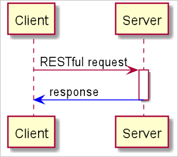
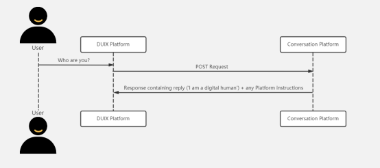

# OpenAPI Integration

**Base URL:** `https://app.duix.ai/`

---

## 1. Prerequisites

### Generate Signature and Obtain Token

When integrating with the **duix-openapi-v2** platform, you must generate access tokens in your own backend.  
Refer to the token guide for implementation details:  
[How to Get Token](./getToken)

---

## 2. Management Interfaces

All management endpoints require a valid **token** in the HTTP request header.

### Interaction Flow



---

### 2.1 Get App Real-Time Concurrency

**Endpoint:** `/duix-openapi-v2/sdk/v2/getconcurrentNumber`  
**Method:** `GET`  
**Description:** Retrieve the real-time concurrency status of an application.

#### Parameters

| Name | Type | Location | Description |
|------|------|-----------|-------------|
| appId | String | Query | Application ID created on the Duix platform |

#### Response

| Name | Type | Description |
|------|------|-------------|
| code | String | Response code |
| data | ConcurrentStatus | Concurrency details |
| cropId | String | Corporate ID |
| totalConcurrentNumber | integer | Total concurrent sessions |
| userConcurrentNumber | integer | User-specific concurrent sessions |
| message | String | Response message |
| success | boolean | Request status |

#### Example Response

```json
{
  "code": "",
  "data": {
    "cropId": "",
    "totalConcurrentNumber": 0,
    "userConcurrentNumber": 0
  },
  "message": "",
  "success": true
}

```

### Get app real-time sessions

##### Endpoint

/duix-openapi-v2/sdk/v2/getconcurrentList

##### Request Method: `GET`

**Description**

Retrieve a list of all active (in-call) sessions for an app.

##### Parameters

| Parameter Name | Type   | Pass Method | Parameter Description |
| -------- | ------ | -------- | ----------------- |
| appId    | String | Query    | APPID created on the Duix platform |

### Close all sessions for an app

##### Endpoint

/duix-openapi-v2/sdk/v2/distroyCallSessionsByAppId

##### Request Method: `GET`

**Description**

Terminate all active sessions for a specific app.

##### Parameters

| Parameter Name | Type   | Pass Method | Parameter Description |
| -------- | ------ | -------- | ----------------- |
| appId    | String | Query    | APPID created on the Duix platform |

##### Example Response

```json
{
  "code": "",
  "data": "",
  "message": "",
  "success": true
}
```

### Close a specific session

##### Endpoint
/duix-openapi-v2/sdk/v2/sessionStop

##### Request Method: `GET`

##### Parameters
| Parameter Name | Type | Pass Method | Parameter Description |
| -------- | -------- | ----- | -------- |
|uuid|String|Query|sessionId returned in the start-complete event|


### Third-Party Dialog Integration (Non-Streaming)

Integrate your own dialog system with Duix using a **webhook-based POST** approach.  
The Duix platform will send user questions to your defined remote URL and expect a structured **JSON response**.



> **Example:**  
> Refer to the open-source demo for a simple integration reference.

---

#### Request

The Duix platform sends each **user question** as a `POST` request to your remote endpoint using the format below.

##### Request Parameters

| Field | Type | Description | Required |
|--------|------|-------------|-----------|
| sid | String | User ID generated during account creation (visible in account info). | Y |
| dh-code | String | Digital human code, unique per digital human (viewable in the avatar overview). | Y |
| dh-question | String | The user’s question text. | Y |
| dh-conversation-id | String | Conversation ID — unique identifier for the session. | Y |
| dh-context | String | Conversation context, formatted as a stringified JSON object. | N |
| dh-context.q.context | String | Previous user question text (context). | N |
| dh-context.a.context | String | Previous digital human answer text (context). | N |
| uuid | String | Request ID used for tracking and troubleshooting. | N |

##### Example Request

```json
{
  "sid": "100003",
  "dh-code": "187265485019156480",
  "dh-question": "Who are you?",
  "dh-conversation-id": "0513e935-041f-48e0-9330-652ef4194511",
  "dh-context": [
    {
      "q": { "context": "user question" },
      "a": { "context": "answer" }
    }
  ]
}

```

Response: Reply using the format below.

| Field    | Type    | Required | Description         |
|---------| ------- | -------- |-----------------|
| code    | String  | Y        | Response status code|
| msg     | String  | N        | Optional success or error message|
| data    | object  | N        | Data payload (see below)|
| success | Boolean | Y        | Whether the request succeeded|

Valid response codes

| Code | Status       | Response                         |
| ---- | ------------ | -------------------------------- |
| 200  | OK           | Successful response |
| 400  | Bad Request  | Invalid body or headers |
| 401  | Unauthorized | Invalid authentication token |
| 403  | Forbidden    | Authentication failed |
| 500  | Server Error | Service exception |

Response body

| Field          | Type   | Description                                                  | Required |
| -------------- | ------ | ------------------------------------------------------------ | -------- |
| conversationId | String | Conversation ID (matches the dh-conversation-id in the request). | Y        |
| question       | String | The user’s question.                               | N        |
| answer         | String | The digital human’s response, as a stringified JSON object. | Y        |
| errorMsg       | String | Description of any exception or error                         | N        |

Example Response

```json
{
  "code": "200",
  "msg": "SUCCESS",
  "success": true,
  "data": {
    "conversationId": "0513e935-041f-48e0-9330-652ef4194511",
    "question": "who are you?",
    "answer": {
      "answer": "Welcome to UneeQ, how can I help?"
    },
    "errorMsg": ""
  }
}
```

Expected response time: Digital human interactions are latency‑sensitive. 95% of requests should complete within 20 seconds. If the response exceeds 20s, a timeout is reported, but the digital human will continue processing and respond once available.

### Third-Party Dialog Integration (Streaming)

In streaming mode, Duix delivers **incremental responses** to your remote endpoint in real time as the digital human speaks.  
This allows you to display or process partial answers before the full response completes.


> **Example:**  
> Refer to the open-source demo for a simple streaming integration example.

---

#### Request

The Duix platform sends each user question to your remote URL via an HTTP `POST` request in the following format.

##### Parameters

| Field | Type | Description | Required |
|--------|------|-------------|-----------|
| sid | String | User ID generated during user creation (visible in account information). | Y |
| dh-code | String | Digital human code, unique per digital human (viewable in the avatar overview). | Y |
| dh-question | String | The question text sent by the user. | Y |
| dh-conversation-id | String | Unique identifier for the conversation. | Y |
| dh-context | String | Conversation context as a stringified JSON object. | N |
| dh-context.q.context | String | Previous question text in the conversation context. | N |
| dh-context.a.context | String | Previous answer text in the conversation context. | N |
| uuid | String | Request ID for tracking and debugging purposes. | N |

##### Example Request

```json
{
  "sid": "100003",
  "dh-code": "187265485019156480",
  "dh-question": "Who are you?",
  "dh-conversation-id": "0513e935-041f-48e0-9330-652ef4194511",
  "dh-context": [
    {
      "q": { "context": "user question" },
      "a": { "context": "answer" }
    }
  ]
}


Response body

| Field  | Type   | Description | Required |
| ------ | ------ | ----------- | -------- |
| answer | String | Partial or complete answer returned by the digital human | Y        |
| isEnd  | boolean | Indicates whether the current response is the final one | Y        |

Example Response

```json
{
    "answer": "Let the Cowherd and Weaver Girl meet on the Milky Way.",
    "isEnd": false
}
```

Expected response time: Digital human interactions are latency‑sensitive. 95% of requests should complete within 20 seconds. If the response exceeds 20s, a timeout is reported, but the digital human will continue to respond.


### Get Conversation Details

Retrieve detailed configuration and metadata for a specific conversation on the Duix platform.

---

#### Endpoint

`/duix-openapi-v2/sdk/getConversationById?conversationId=[conversation_id]`

#### Method

`GET`

#### Description

Query conversation details by providing the **conversation ID** obtained from the Duix platform.

---

#### Parameters

| Name | Type | Location | Description |
|------|------|-----------|-------------|
| conversationId | String | Query | Unique conversation ID generated by the Duix platform |

---

#### Response

| Field | Type | Description |
|--------|------|-------------|
| code | String | Response code |
| data | JSON | Main conversation data |
| detailDto | JSON | Conversation resource details (includes model, background, and TTS configuration) |
| detailDto.backgroundDto | JSON | Background resource details |
| detailDto.modelId | String | Model ID |
| detailDto.modelName | String | Model name |
| detailDto.modelIdType | String | Model type (0 = Cloud Digital Human, 1 = Local Digital Human) |
| detailDto.localModelInfo | JSON | Local digital human information |
| detailDto.backgroundDto.backgroundUrl | String | Background image or video URL |
| scriptDtoList | JSON | Predefined dialog scripts |
| scriptDtoList.scriptType | String | Script type (0: Wake-up Word, 1: Opening Line, 2: Waiting Phrase, 3: Unknown Question, 4: Farewell, 5: Interruption, 6: Interruption Sentence, 7: Guiding Phrase) |
| scriptDtoList.scriptContent | String | Script text |
| scriptDtoList.ttsContent | String | Script audio file URL |
| message | String | Text message returned by the API |
| success | Boolean | Request success flag |

---

#### Example Response

```json
{
	"success": true,
	"code": "0",
	"message": "SUCCESS",
	"msg": "SUCCESS",
	"data": {
		"id": "108",
		"conversationName": "Unnamed-18:04",
		"language": "zh",
		"corpId": "1003645",
		"userId": "3959",
		"conversationConfigDto": null,
		"maxConversation": 2,
		"dataModelIsUsed": 1,
		"knowledgeIsUsed": 1,
		"fileIsUsed": 0,
		"thirdIsUsed": 0,
		"isFreedom": 0,
		"asrProvider": null,
		"conversationInfoDto": {
			"id": 109,
			"name": "1",
			"nickName": "",
			"gender": 1,
			"age": 0,
			"height": 0,
			"weight": 0,
			"characters": "",
			"backStory": ""
		},
		"detailDto": {
			"id": 95,
			"conversationId": "108",
			"proportion": "16:9",
			"terminalType": 0,
			"modelId": "321486924406853",
			"modelIdType": 0,
			"imageId": null,
			"sceneId": null,
			"modelName": "Model name",
			"sceneType": 0,
			"background": 1,
			"backgroundDto": {
				"id": 1,
				"backgroundCode": "1591003727513522176",
				"backgroundName": "zuoyi.jpg",
				"backgroundUrl": "/video-server/jpg/1592809647136509954.jpg",
				"fileType": 0,
				"proportion": "16:9",
				"userId": null
			},
			"modelConfig": null,
			"ttsId": "15",
			"ttsName": "guina",
			"ttsConfig": null,
			"ttsUrl": "",
			"ttsVolume": 0,
			"ttsSpeaker": "zhifeng_emo",
			"ttsSpeedRate": 0,
			"ttsPitch": 0,
			"ttsSource": 20,
			"samplePictureUrl": "/model/2023/02/06/c5348a17fac75feb0152a0c599b7af87.png",
			"videoWidth": 1920,
			"videoHeight": 1920,
			"humanProportion": "9:16",
			"humanWidth": 540,
			"humanHeight": 960,
			"humanX": 690,
			"humanY": 120,
			"localModelInfo": null
		},
		"knowledgeDtoList": [],
		"kbConversationDto": null,
		"modelDtoList": [
			{
				"id": 487,
				"conversationId": "108",
				"largeModelType": 0,
				"modelCode": 0,
				"largeName": "chatbot_law",
				"modelId": "1",
				"prompt": "Task: Your name is Zhang San, a real celebrity with a mischievous tone, humor, and a love for joking. Chatting with fans and friends, generating content replies in an oral style. \Requirements for generation: 1. Use my own name, 2. Meet the persona, 3. Prohibit the generation of English content, all must be generated in Chinese. 4. Within 30 words.",
				"botUrl": ""
			}
		],
		"thirdDto": null,
		"scriptDtoList": [
			{
				"id": 2728,
				"conversationId": "108",
				"scriptType": 0,
				"scriptContent": "Els silvrants",
				"ttsContent": null,
				"emotion": "0"
			},
			{
				"id": 2729,
				"conversationId": "108",
				"scriptType": 1,
				"scriptContent": "Hello, welcome to Duix",
				"ttsContent": "https://digital-public-dev.obs.cn-east-3.myhuaweicloud.com/tts-proxy/2024-02-20/1800-_-633043663081836544--FC34641E6EB0A22404C845E219904E81.wav",
				"emotion": "0"
			},
			{
				"id": 2730,
				"conversationId": "108",
				"scriptType": 2,
				"scriptContent": "Wait a moment, I'll think about it",
				"ttsContent": "https://digital-public-dev.obs.cn-east-3.myhuaweicloud.com/tts-proxy/2024-02-20/1630-_-633043667485855744--3F501A3CA51F4DFAFBACE254DD2E3E32.wav",
				"emotion": "0"
			},
			{
				"id": 2731,
				"conversationId": "108",
				"scriptType": 3,
				"scriptContent": "Sorry, I don't quite understand what you mean",
				"ttsContent": "https://digital-public-dev.obs.cn-east-3.myhuaweicloud.com/tts-proxy/2024-02-20/2300-_-633043669830471680--2C5A656A6FBEA2CE09037F21F3DF8434.wav",
				"emotion": "0"
			},
			{
				"id": 2732,
				"conversationId": "108",
				"scriptType": 4,
				"scriptContent": "Sorry, I don't quite understand what you mean",
				"ttsContent": "https://digital-public-dev.obs.cn-east-3.myhuaweicloud.com/tts-proxy/2024-02-20/560-_-633043672326082560--051995577E5C4B5818F952C04A7997E2.wav",
				"emotion": "0"
			},
			{
				"id": 2733,
				"conversationId": "108",
				"scriptType": 5,
				"scriptContent": "Stop talking",
				"ttsContent": null,
				"emotion": "0"
			},
			{
				"id": 2734,
				"conversationId": "108",
				"scriptType": 6,
				"scriptContent": "Okay, you can speak first",
				"ttsContent": "https://digital-public-dev.obs.cn-east-3.myhuaweicloud.com/tts-proxy/2024-02-20/1600-_-633043674196742144--FC70FD95B50E8CEC9D9151905AE13F7F.wav",
				"emotion": "0"
			},
			{
				"id": 2735,
				"conversationId": "108",
				"scriptType": 7,
				"scriptContent": "What is a digital person",
				"ttsContent": "https://digital-public-dev.obs.cn-east-3.myhuaweicloud.com/tts-proxy/2024-02-20/1080-_-633043676541358080--414A4CBCE8B52677F05DAECFD1437BD0.wav",
				"emotion": "0"
			}
		]
	}
}
```


### Create Avatar

Create a new **AI avatar** programmatically through the Duix OpenAPI.

---

#### Endpoint

`/duix-openapi-v2/sdk/v2/createAvatar`

#### Method

`POST`

---

#### Description

This endpoint allows you to create an AI avatar by training with either a **video** or a **photo**.  
If a `profile` is provided, a default conversation will be automatically created after the training completes.

---

#### Parameters

| Name | Type | Location | Description | Required |
|------|------|-----------|-------------|-----------|
| customType | Integer | Body | Training method: `1` = train with video, `2` = train with photo. | Y |
| avatarName | String | Body | Name of the avatar. | Y |
| gender | String | Body | Avatar gender (`male`, `female`, `other`). | N |
| profile | String | Body | Text profile used to power avatar conversations. If provided, a default conversation is created automatically. | N |
| templateVideo | String | Body | URL of the training video. Required when training with video. | N |
| coverUrl | String | Body | URL of the training photo. Required when training with photo. | N |
| audioUrl | String | Body | URL of the training audio file. | N |
| ttsSpeaker | String | Body | Voice selection for TTS output. | N |
| videoStart | float | Body | Video start time (in seconds). Default: `0`. | N |
| videoEnd | float | Body | Video end time (in seconds). Default: `5`. | N |
| audioStart | float | Body | Audio start time (in seconds). Default: `0`. | N |
| audioEnd | float | Body | Audio end time (in seconds). Default: `10`. | N |

---

#### File Requirements

> **Photo training**
> - Format: JPG or PNG  
> - Max size: **10 MB**  
> - Recommended resolution: **1080p**  
> - Aspect ratio: **9:16** or **16:9**

> **Video training**
> - Format: MP4 or MOV  
> - Duration: **10 s – 1 min**  
> - Max size: **1 GB**

> **Audio**
> - Format: MP3 / WAV / FLAC / M4A  
> - Duration: **5 s – 30 min**

> **Note:**  
> For best results, ensure video duration is at least **5 seconds** and audio duration is between **5 – 10 seconds**.

---

#### Response

| Field | Type | Description |
|--------|------|-------------|
| code | String | Response code |
| data | JSON | Response payload |
| data.id | Integer | Avatar ID (use this to query avatar details) |
| msg | String | Response message |
| success | Boolean | Indicates whether the request succeeded |

---

#### Example Response

```json
{
  "code": "0",
  "msg": "SUCCESS",
  "success": true,
  "data": {
    "id": 1111
  }
}
```

### Query Avatar

Retrieve information about an existing AI avatar using its unique **avatar ID**.

---

#### Endpoint

`/duix-openapi-v2/sdk/v2/queryAvatar`

#### Method

`GET`

---

#### Description

This endpoint returns metadata and training status for an AI avatar previously created through the API.

---

#### Parameters

| Name | Type | Location | Description | Required |
|------|------|-----------|-------------|-----------|
| id | Integer | Query | Unique avatar ID returned by the `createAvatar` API. | Y |

---

#### Response

| Field | Type | Description |
|--------|------|-------------|
| code | String | Response code. |
| msg | String | Response message. |
| success | Boolean | Indicates whether the request succeeded. |
| data | JSON | Response payload containing avatar details. |
| data.id | Integer | Avatar ID. |
| data.customizedName | String | Avatar name. |
| data.customizedStatus | Integer | Avatar training status (`0`: training, `1`: success, `2`: failed). |
| data.reason | String | Failure reason, if training failed. |
| data.defaultConversationId | String | Default conversation ID associated with this avatar. |

---

#### Example Response

```json
{
  "code": "0",
  "msg": "SUCCESS",
  "success": true,
  "data": {
    "id": 111,
    "customizedName": "video-11",
    "customizedStatus": 1,
    "reason": "",
    "defaultConversationId": "7f82f1c2-a6e4-4dc2-94d2-124c41ef8a1c"
  }
}
